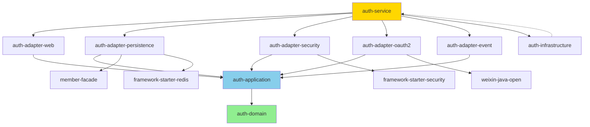

# Auth Service 重构规范文档 (Refactoring Specification)

> **版本**: v1.0  
> **日期**: 2025-11-06  
> **作者**: Senior Software Architect  
> **目标**: 工业级、可扩展、高内聚低耦合的认证授权服务架构

---

## 📋 目录

1. [当前架构分析](#1-当前架构分析)
2. [重构目标与原则](#2-重构目标与原则)
3. [目标架构设计](#3-目标架构设计)
4. [模块化设计方案](#4-模块化设计方案)
5. [分层架构设计](#5-分层架构设计)
6. [依赖关系优化](#6-依赖关系优化)
7. [领域模型设计](#7-领域模型设计)
8. [扩展点设计](#8-扩展点设计)
9. [安全性增强](#9-安全性增强)
10. [技术规范](#10-技术规范)
11. [实施路径](#11-实施路径)

---

## 1. 当前架构分析

### 1.1 现状评估

#### 依赖关系
```
auth-service
├── framework-common (通用工具、异常、配置)
├── framework-starter-security (Security + JWT)
├── framework-starter-redis (Redis 缓存)
├── framework-starter-ratelimit (限流)
├── framework-starter-touch (审计日志)
├── member-facade (OpenFeign 接口)
├── spring-cloud-openfeign (服务调用)
└── weixin-java-open (微信 OAuth2)
```

#### 当前问题识别

**🔴 架构层面问题**:
1. **紧耦合**: auth-service 直接依赖 member-facade，服务边界不清晰
2. **职责混乱**: 认证(Authentication)、授权(Authorization)、用户管理职责未分离
3. **扩展性差**: OAuth2 Provider 硬编码（GitHub、Google、WeChat），新增需修改核心代码
4. **缺乏抽象**: 无统一的认证策略接口，Strategy 模式未充分应用

**🟡 代码层面问题**:
1. **配置分散**: JWT 配置在 framework-common 和 framework-starter-security 重复
2. **缺乏统一异常**: 认证授权异常处理未标准化
3. **Token 管理混乱**: AccessToken、RefreshToken 逻辑分散
4. **缺乏审计**: 登录/登出/权限变更未完整记录

**🟢 优点保持**:
1. ✅ 使用了 Spring Security 标准框架
2. ✅ JWT 无状态认证设计合理
3. ✅ Redis 缓存提升性能
4. ✅ 限流和审计日志基础设施完善

---

## 2. 重构目标与原则

### 2.1 SOLID 原则应用

| 原则 | 应用场景 |
|------|---------|
| **SRP** (单一职责) | 认证服务只负责认证逻辑，授权逻辑独立，用户信息获取通过适配器模式 |
| **OCP** (开闭原则) | 通过 SPI 机制支持新认证方式，无需修改核心代码 |
| **LSP** (里氏替换) | 所有认证策略实现统一接口，可互相替换 |
| **ISP** (接口隔离) | 拆分大接口为细粒度接口（认证、授权、用户查询） |
| **DIP** (依赖倒置) | 依赖抽象接口而非具体实现，member-facade 通过 adapter 适配 |

### 2.2 DDD 战术设计

```
认证授权域 (Authentication & Authorization Domain)
├── 认证聚合根 (Authentication Aggregate)
│   ├── 认证凭证 (Credential)
│   ├── 认证令牌 (Token)
│   └── 认证会话 (Session)
├── 授权聚合根 (Authorization Aggregate)
│   ├── 主体 (Principal)
│   ├── 权限 (Permission)
│   └── 角色 (Role)
└── 值对象
    ├── TokenPair (AccessToken + RefreshToken)
    ├── AuthResult (认证结果)
    └── GrantedAuthorities (授权信息)
```

### 2.3 架构目标

1. **高内聚低耦合**: 通过 Hexagonal Architecture（六边形架构）隔离核心业务
2. **可测试性**: 核心业务逻辑不依赖外部服务，易于单元测试
3. **可扩展性**: 支持插件化扩展（新认证方式、新存储、新协议）
4. **高性能**: 多级缓存、异步处理、批量操作
5. **高可用**: 无状态设计、灰度发布支持、降级策略

---

## 3. 目标架构设计

### 3.1 Hexagonal Architecture (六边形架构)

```
┌─────────────────────────────────────────────────────────────┐
│                    Adapters (适配器层)                        │
├─────────────────────────────────────────────────────────────┤
│                                                               │
│  ┌────────────────┐    ┌────────────────┐    ┌────────────┐ │
│  │  REST API      │    │  gRPC API      │    │  Event     │ │
│  │  Controller    │    │  Service       │    │  Listener  │ │
│  └────────────────┘    └────────────────┘    └────────────┘ │
│                                                               │
│  ┌────────────────────────────────────────────────────────┐  │
│  │              Ports (入站端口 - Use Cases)              │  │
│  ├────────────────────────────────────────────────────────┤  │
│  │  - AuthenticateUseCase                                │  │
│  │  - RefreshTokenUseCase                                │  │
│  │  - RevokeTokenUseCase                                 │  │
│  │  - ValidatePermissionUseCase                          │  │
│  └────────────────────────────────────────────────────────┘  │
│                                                               │
├═════════════════════════════════════════════════════════════┤
│                    Core Domain (核心域)                       │
├═════════════════════════════════════════════════════════════┤
│                                                               │
│  ┌────────────────────────────────────────────────────────┐  │
│  │              Domain Services (领域服务)                │  │
│  ├────────────────────────────────────────────────────────┤  │
│  │  - AuthenticationService                              │  │
│  │  - AuthorizationService                               │  │
│  │  - TokenManagementService                             │  │
│  │  - PasswordPolicyService                              │  │
│  └────────────────────────────────────────────────────────┘  │
│                                                               │
│  ┌────────────────────────────────────────────────────────┐  │
│  │              Domain Model (领域模型)                   │  │
│  ├────────────────────────────────────────────────────────┤  │
│  │  - Authentication Aggregate                           │  │
│  │  - Authorization Aggregate                            │  │
│  │  - Value Objects                                      │  │
│  └────────────────────────────────────────────────────────┘  │
│                                                               │
│  ┌────────────────────────────────────────────────────────┐  │
│  │              Ports (出站端口 - Repository)             │  │
│  ├────────────────────────────────────────────────────────┤  │
│  │  - UserRepository (接口)                              │  │
│  │  - TokenRepository (接口)                             │  │
│  │  - PermissionRepository (接口)                        │  │
│  │  - AuditLogPublisher (接口)                           │  │
│  └────────────────────────────────────────────────────────┘  │
│                                                               │
├─────────────────────────────────────────────────────────────┤
│               Infrastructure (基础设施层)                     │
├─────────────────────────────────────────────────────────────┤
│                                                               │
│  ┌────────────────┐    ┌────────────────┐    ┌────────────┐ │
│  │  Member Feign  │    │  Redis Cache   │    │  Event Bus │ │
│  │  Adapter       │    │  Repository    │    │  Publisher │ │
│  └────────────────┘    └────────────────┘    └────────────┘ │
│                                                               │
└─────────────────────────────────────────────────────────────┘
```

### 3.2 模块结构

```
auth/
├── auth-domain/                        # 核心域模块（无外部依赖）
│   ├── src/main/java/
│   │   └── com.pot.auth.domain/
│   │       ├── model/                  # 领域模型
│   │       │   ├── authentication/     # 认证聚合
│   │       │   │   ├── Authentication.java
│   │       │   │   ├── Credential.java
│   │       │   │   ├── Token.java
│   │       │   │   └── AuthSession.java
│   │       │   ├── authorization/      # 授权聚合
│   │       │   │   ├── Principal.java
│   │       │   │   ├── Permission.java
│   │       │   │   ├── Role.java
│   │       │   │   └── GrantedAuthority.java
│   │       │   └── valueobject/        # 值对象
│   │       │       ├── TokenPair.java
│   │       │       ├── AuthResult.java
│   │       │       ├── UserId.java
│   │       │       └── CredentialType.java
│   │       ├── service/                # 领域服务
│   │       │   ├── AuthenticationService.java
│   │       │   ├── AuthorizationService.java
│   │       │   ├── TokenManagementService.java
│   │       │   └── PasswordPolicyService.java
│   │       ├── repository/             # 仓储接口（出站端口）
│   │       │   ├── UserRepository.java
│   │       │   ├── TokenRepository.java
│   │       │   ├── PermissionRepository.java
│   │       │   └── RoleRepository.java
│   │       ├── event/                  # 领域事件
│   │       │   ├── UserAuthenticatedEvent.java
│   │       │   ├── TokenRefreshedEvent.java
│   │       │   ├── PermissionGrantedEvent.java
│   │       │   └── AuthenticationFailedEvent.java
│   │       └── exception/              # 领域异常
│   │           ├── AuthenticationException.java
│   │           ├── AuthorizationException.java
│   │           ├── InvalidCredentialException.java
│   │           └── TokenExpiredException.java
│   └── pom.xml                         # 依赖: 仅 Java 基础库 + Lombok
│
├── auth-application/                   # 应用服务层（编排层）
│   ├── src/main/java/
│   │   └── com.pot.auth.application/
│   │       ├── port.in/                # 入站端口（Use Cases）
│   │       │   ├── AuthenticateUseCase.java
│   │       │   ├── RefreshTokenUseCase.java
│   │       │   ├── RevokeTokenUseCase.java
│   │       │   ├── ValidatePermissionUseCase.java
│   │       │   └── ChangePasswordUseCase.java
│   │       ├── port.out/               # 出站端口（扩展）
│   │       │   ├── LoadUserPort.java
│   │       │   ├── SaveTokenPort.java
│   │       │   ├── CachePort.java
│   │       │   └── AuditLogPort.java
│   │       ├── service/                # 应用服务实现
│   │       │   ├── AuthenticationApplicationService.java
│   │       │   ├── AuthorizationApplicationService.java
│   │       │   └── TokenApplicationService.java
│   │       ├── dto/                    # 数据传输对象
│   │       │   ├── request/
│   │       │   │   ├── LoginRequest.java
│   │       │   │   ├── OAuth2LoginRequest.java
│   │       │   │   └── RefreshTokenRequest.java
│   │       │   └── response/
│   │       │       ├── AuthResponse.java
│   │       │       ├── TokenResponse.java
│   │       │       └── PermissionResponse.java
│   │       └── strategy/               # 策略模式（认证策略）
│   │           ├── AuthenticationStrategy.java
│   │           ├── UsernamePasswordStrategy.java
│   │           ├── PhoneCodeStrategy.java
│   │           ├── EmailCodeStrategy.java
│   │           └── OAuth2Strategy.java
│   └── pom.xml                         # 依赖: auth-domain
│
├── auth-adapter/                       # 适配器层
│   ├── auth-adapter-web/               # REST API 适配器
│   │   ├── src/main/java/
│   │   │   └── com.pot.auth.adapter.web/
│   │   │       ├── controller/
│   │   │       │   ├── AuthenticationController.java
│   │   │       │   ├── OAuth2Controller.java
│   │   │       │   └── TokenController.java
│   │   │       ├── interceptor/
│   │   │       │   └── RateLimitInterceptor.java
│   │   │       └── assembler/          # DTO <-> Domain 转换
│   │   │           └── AuthAssembler.java
│   │   └── pom.xml
│   │
│   ├── auth-adapter-persistence/       # 持久化适配器
│   │   ├── src/main/java/
│   │   │   └── com.pot.auth.adapter.persistence/
│   │   │       ├── member/             # Member Service 适配
│   │   │       │   ├── MemberUserRepositoryAdapter.java
│   │   │       │   ├── MemberFeignClient.java (内部)
│   │   │       │   └── MemberUserMapper.java
│   │   │       ├── redis/              # Redis 缓存适配
│   │   │       │   ├── RedisTokenRepositoryAdapter.java
│   │   │       │   ├── RedisPermissionCacheAdapter.java
│   │   │       │   └── RedisKeyGenerator.java
│   │   │       └── local/              # 本地存储（可选）
│   │   │           └── InMemoryTokenRepository.java
│   │   └── pom.xml
│   │
│   ├── auth-adapter-security/          # Security 框架适配
│   │   ├── src/main/java/
│   │   │   └── com.pot.auth.adapter.security/
│   │   │       ├── SecurityConfiguration.java
│   │   │       ├── JwtAuthenticationFilter.java
│   │   │       ├── SecurityContextAdapter.java
│   │   │       └── PermissionEvaluatorAdapter.java
│   │   └── pom.xml
│   │
│   ├── auth-adapter-oauth2/            # OAuth2 Provider 适配器
│   │   ├── src/main/java/
│   │   │   └── com.pot.auth.adapter.oauth2/
│   │   │       ├── OAuth2ClientRegistry.java
│   │   │       ├── provider/
│   │   │       │   ├── OAuth2Provider.java (SPI)
│   │   │       │   ├── GitHubOAuth2Provider.java
│   │   │       │   ├── GoogleOAuth2Provider.java
│   │   │       │   └── WeChatOAuth2Provider.java
│   │   │       └── mapper/
│   │   │           └── OAuth2UserInfoMapper.java
│   │   └── pom.xml
│   │
│   └── auth-adapter-event/             # 事件发布适配器
│       ├── src/main/java/
│       │   └── com.pot.auth.adapter.event/
│       │       ├── AuditLogPublisherAdapter.java
│       │       └── DomainEventPublisherAdapter.java
│       └── pom.xml
│
├── auth-infrastructure/                # 基础设施配置
│   ├── src/main/java/
│   │   └── com.pot.auth.infrastructure/
│   │       ├── config/
│   │       │   ├── JwtConfiguration.java
│   │       │   ├── RedisConfiguration.java
│   │       │   ├── FeignConfiguration.java
│   │       │   └── EventBusConfiguration.java
│   │       └── properties/
│   │           ├── AuthProperties.java
│   │           └── OAuth2Properties.java
│   └── pom.xml
│
├── auth-service/                       # 服务启动模块
│   ├── src/main/java/
│   │   └── com.pot.auth.service/
│   │       └── AuthServiceApplication.java
│   ├── src/main/resources/
│   │   ├── application.yml
│   │   ├── application-dev.yml
│   │   ├── application-prod.yml
│   │   └── bootstrap.yml
│   └── pom.xml                         # 聚合所有模块依赖
│
└── auth-starter/                       # 其他服务依赖的 Starter
    ├── src/main/java/
    │   └── com.pot.auth.starter/
    │       ├── annotation/
    │       │   ├── EnableAuthClient.java
    │       │   ├── RequiresAuthentication.java
    │       │   └── RequiresPermissions.java
    │       ├── autoconfigure/
    │       │   └── AuthClientAutoConfiguration.java
    │       └── client/
    │           └── AuthClient.java     # 其他服务调用接口
    └── pom.xml
```

---

## 4. 模块化设计方案

### 4.1 模块依赖关系



**依赖原则**:
- ✅ 核心域 `auth-domain` 无任何框架依赖
- ✅ 应用层 `auth-application` 仅依赖核心域
- ✅ 适配器依赖应用层，实现出站端口
- ✅ `auth-service` 负责装配所有组件
- ❌ 严禁适配器之间相互依赖

### 4.2 模块职责矩阵

| 模块 | 职责 | 外部依赖 | 稳定性 |
|------|------|----------|--------|
| **auth-domain** | 核心业务逻辑、领域模型 | 无 | ⭐⭐⭐⭐⭐ |
| **auth-application** | 用例编排、业务流程 | auth-domain | ⭐⭐⭐⭐ |
| **auth-adapter-web** | REST API 暴露 | Spring Web | ⭐⭐⭐ |
| **auth-adapter-persistence** | 数据持久化、服务调用 | Member, Redis | ⭐⭐⭐ |
| **auth-adapter-security** | Spring Security 集成 | Security Framework | ⭐⭐⭐ |
| **auth-adapter-oauth2** | 第三方登录集成 | OAuth2 SDK | ⭐⭐ |
| **auth-adapter-event** | 事件发布、审计日志 | Event Bus | ⭐⭐ |
| **auth-infrastructure** | 配置管理、Bean 装配 | Spring Boot | ⭐⭐⭐⭐ |

---

## 5. 分层架构设计

### 5.1 严格分层规则

```
┌────────────────────────────────────────────────┐
│          表示层 (Presentation Layer)           │  ← REST/gRPC/GraphQL
├────────────────────────────────────────────────┤
│          应用层 (Application Layer)            │  ← Use Cases
├────────────────────────────────────────────────┤
│            领域层 (Domain Layer)               │  ← Core Business
├────────────────────────────────────────────────┤
│        基础设施层 (Infrastructure Layer)       │  ← Frameworks
└────────────────────────────────────────────────┘

调用方向: 自上而下，禁止反向依赖
通信方式: 通过接口（Port）隔离
```

### 5.2 层间交互协议

#### 5.2.1 Controller → Application

```java
// Controller 负责：参数校验、DTO 转换、HTTP 状态码
@RestController
@RequestMapping("/api/v1/auth")
public class AuthenticationController {
    private final AuthenticateUseCase authenticateUseCase;
    
    @PostMapping("/login")
    public R<AuthResponse> login(@Valid @RequestBody LoginRequest request) {
        // 1. 校验参数
        ValidationUtils.validate(request);
        
        // 2. 调用用例
        AuthResult result = authenticateUseCase.authenticate(
            request.getUsername(),
            request.getPassword(),
            request.getDeviceInfo()
        );
        
        // 3. 转换响应
        return R.success(AuthAssembler.toAuthResponse(result));
    }
}
```

#### 5.2.2 Application → Domain

```java
// Application 负责：流程编排、事务管理、异常转换
@Service
@Transactional
public class AuthenticationApplicationService implements AuthenticateUseCase {
    private final AuthenticationService domainService;
    private final LoadUserPort loadUserPort;
    private final SaveTokenPort saveTokenPort;
    private final AuditLogPort auditLogPort;
    
    @Override
    public AuthResult authenticate(String username, String password, DeviceInfo device) {
        try {
            // 1. 加载用户
            User user = loadUserPort.loadByUsername(username)
                .orElseThrow(() -> new UserNotFoundException(username));
            
            // 2. 调用领域服务
            Authentication authentication = domainService.authenticate(
                new Credential(username, password),
                user
            );
            
            // 3. 生成令牌
            TokenPair tokens = authentication.generateTokens();
            
            // 4. 持久化
            saveTokenPort.save(tokens);
            
            // 5. 发布事件
            auditLogPort.publish(new UserAuthenticatedEvent(user.getId(), device));
            
            return AuthResult.success(authentication, tokens);
            
        } catch (DomainException e) {
            // 转换为应用异常
            throw new AuthenticationFailedException(e);
        }
    }
}
```

#### 5.2.3 Domain 核心逻辑

```java
// Domain 负责：纯业务逻辑、不依赖外部
@Service
public class AuthenticationService {
    private final PasswordPolicyService passwordPolicy;
    
    public Authentication authenticate(Credential credential, User user) {
        // 1. 验证用户状态
        if (!user.isActive()) {
            throw new AccountLockedException(user.getId());
        }
        
        // 2. 验证密码
        if (!passwordPolicy.matches(credential.getPassword(), user.getPasswordHash())) {
            user.recordFailedAttempt();
            throw new InvalidCredentialException();
        }
        
        // 3. 重置失败次数
        user.resetFailedAttempts();
        
        // 4. 创建认证对象
        return Authentication.create(user, credential.getType());
    }
}
```

---

## 6. 依赖关系优化

### 6.1 解耦 Member 依赖

#### 问题
当前 `auth-service` 直接依赖 `member-facade`，导致：
- 服务边界模糊
- 循环依赖风险
- 难以独立部署

#### 解决方案：Anti-Corruption Layer (防腐层)

```java
// auth-application/port.out/LoadUserPort.java
public interface LoadUserPort {
    Optional<AuthUser> loadByUsername(String username);
    Optional<AuthUser> loadByEmail(String email);
    Optional<AuthUser> loadByPhone(String phone);
    Optional<AuthUser> loadById(UserId userId);
}

// auth-adapter-persistence/member/MemberUserRepositoryAdapter.java
@Component
public class MemberUserRepositoryAdapter implements LoadUserPort {
    private final MemberFeignClient memberClient;
    private final MemberUserMapper mapper;
    
    @Override
    @Cacheable(value = "auth:user", key = "#username")
    public Optional<AuthUser> loadByUsername(String username) {
        try {
            R<MemberDTO> response = memberClient.getByUsername(username);
            if (!response.isSuccess()) {
                return Optional.empty();
            }
            // 防腐层：转换为领域模型
            return Optional.of(mapper.toDomain(response.getData()));
        } catch (FeignException e) {
            log.error("Failed to load user from member-service", e);
            return Optional.empty();
        }
    }
}
```

**优势**:
- ✅ 隔离外部变化，Member Service 接口变更不影响核心域
- ✅ 可替换实现（测试时用 Mock，迁移时用 Local DB）
- ✅ 统一异常处理和降级策略

### 6.2 Framework 依赖优化

#### 问题
- JWT 配置在多个模块重复
- Security 配置硬编码在 Starter

#### 解决方案：配置外部化 + 适配器隔离

```yaml
# auth-service/application.yml
zing:
  auth:
    jwt:
      secret-key: ${JWT_SECRET:should-be-in-vault}
      access-token-ttl: 1h
      refresh-token-ttl: 30d
      issuer: zing-auth
    security:
      whitelist:
        - /api/v1/auth/login
        - /api/v1/auth/register
        - /api/v1/oauth2/**
    cache:
      enabled: true
      ttl: 30m
```

```java
// auth-infrastructure/config/AuthConfiguration.java
@Configuration
@EnableConfigurationProperties(AuthProperties.class)
public class AuthConfiguration {
    
    @Bean
    public JwtTokenProvider jwtTokenProvider(AuthProperties props) {
        return new JwtTokenProvider(
            props.getJwt().getSecretKey(),
            props.getJwt().getAccessTokenTtl(),
            props.getJwt().getRefreshTokenTtl()
        );
    }
}
```

---

## 7. 领域模型设计

### 7.1 认证聚合根 (Authentication Aggregate)

```java
/**
 * 认证聚合根
 * 负责：用户身份验证、令牌生成、会话管理
 */
public class Authentication {
    private AuthenticationId id;
    private UserId userId;
    private CredentialType credentialType;
    private AuthenticationStatus status;
    private Instant authenticatedAt;
    private DeviceInfo deviceInfo;
    private IpAddress ipAddress;
    
    // 业务方法
    public TokenPair generateTokens(TokenFactory factory) {
        if (!this.isSuccessful()) {
            throw new IllegalStateException("Cannot generate tokens for failed authentication");
        }
        return factory.createTokenPair(this);
    }
    
    public void invalidate() {
        this.status = AuthenticationStatus.INVALIDATED;
        DomainEvents.publish(new AuthenticationInvalidatedEvent(this.id));
    }
    
    // 工厂方法
    public static Authentication create(User user, CredentialType type) {
        Authentication auth = new Authentication();
        auth.id = AuthenticationId.generate();
        auth.userId = user.getId();
        auth.credentialType = type;
        auth.status = AuthenticationStatus.SUCCESS;
        auth.authenticatedAt = Instant.now();
        
        DomainEvents.publish(new UserAuthenticatedEvent(user.getId(), type));
        return auth;
    }
}
```

### 7.2 授权聚合根 (Authorization Aggregate)

```java
/**
 * 授权聚合根
 * 负责：权限判定、角色管理、访问控制
 */
public class Principal {
    private UserId userId;
    private Set<Role> roles;
    private Set<Permission> permissions;
    private DataScope dataScope;
    
    // 业务方法
    public boolean hasPermission(String resource, String action) {
        // 1. 检查直接权限
        if (permissions.stream().anyMatch(p -> p.matches(resource, action))) {
            return true;
        }
        
        // 2. 检查角色权限
        return roles.stream()
            .flatMap(role -> role.getPermissions().stream())
            .anyMatch(p -> p.matches(resource, action));
    }
    
    public void grantRole(Role role) {
        if (roles.add(role)) {
            DomainEvents.publish(new RoleGrantedEvent(this.userId, role.getId()));
        }
    }
    
    public void revokeRole(Role role) {
        if (roles.remove(role)) {
            DomainEvents.publish(new RoleRevokedEvent(this.userId, role.getId()));
        }
    }
}
```

### 7.3 值对象设计

```java
// TokenPair.java
@Value
@Builder
public class TokenPair {
    String accessToken;
    String refreshToken;
    Instant accessTokenExpiresAt;
    Instant refreshTokenExpiresAt;
    TokenType tokenType;  // Bearer
    
    public boolean isAccessTokenExpired() {
        return Instant.now().isAfter(accessTokenExpiresAt);
    }
    
    public Duration remainingAccessTokenTtl() {
        return Duration.between(Instant.now(), accessTokenExpiresAt);
    }
}

// CredentialType.java
public enum CredentialType {
    USERNAME_PASSWORD("用户名密码"),
    PHONE_CODE("手机验证码"),
    EMAIL_CODE("邮箱验证码"),
    OAUTH2_GITHUB("GitHub OAuth2"),
    OAUTH2_GOOGLE("Google OAuth2"),
    OAUTH2_WECHAT("微信 OAuth2"),
    BIOMETRIC("生物识别");
    
    private final String description;
}
```

---

## 8. 扩展点设计

### 8.1 认证策略扩展点 (SPI)

```java
// auth-application/strategy/AuthenticationStrategy.java
public interface AuthenticationStrategy {
    /**
     * 支持的凭证类型
     */
    CredentialType supportedType();
    
    /**
     * 执行认证
     */
    Authentication authenticate(Credential credential);
    
    /**
     * 优先级（数字越小优先级越高）
     */
    default int priority() {
        return Integer.MAX_VALUE;
    }
}

// 实现示例
@Component
public class OAuth2Strategy implements AuthenticationStrategy {
    private final OAuth2ClientRegistry clientRegistry;
    private final LoadUserPort loadUserPort;
    
    @Override
    public CredentialType supportedType() {
        return CredentialType.OAUTH2;
    }
    
    @Override
    public Authentication authenticate(Credential credential) {
        OAuth2Credential oauth2Cred = (OAuth2Credential) credential;
        
        // 1. 获取 OAuth2 客户端
        OAuth2Provider provider = clientRegistry.getProvider(oauth2Cred.getProvider());
        
        // 2. 获取用户信息
        OAuth2UserInfo userInfo = provider.getUserInfo(oauth2Cred.getCode());
        
        // 3. 查找或创建本地用户
        AuthUser user = loadUserPort.loadByOAuth2(userInfo.getProviderId())
            .orElseGet(() -> createUserFromOAuth2(userInfo));
        
        // 4. 创建认证对象
        return Authentication.create(user, supportedType());
    }
}

// 策略注册器
@Component
public class AuthenticationStrategyRegistry {
    private final Map<CredentialType, AuthenticationStrategy> strategies;
    
    public AuthenticationStrategyRegistry(List<AuthenticationStrategy> strategyList) {
        this.strategies = strategyList.stream()
            .collect(Collectors.toMap(
                AuthenticationStrategy::supportedType,
                Function.identity()
            ));
    }
    
    public AuthenticationStrategy getStrategy(CredentialType type) {
        return Optional.ofNullable(strategies.get(type))
            .orElseThrow(() -> new UnsupportedCredentialTypeException(type));
    }
}
```

### 8.2 Token 存储扩展点

```java
// auth-application/port.out/TokenStore.java
public interface TokenStore {
    void save(TokenPair tokenPair, UserId userId);
    Optional<TokenPair> findByAccessToken(String accessToken);
    Optional<TokenPair> findByRefreshToken(String refreshToken);
    void revoke(String token);
    void revokeAllByUserId(UserId userId);
}

// Redis 实现
@Component
@Primary
public class RedisTokenStore implements TokenStore {
    private final RedisTemplate<String, TokenPair> redisTemplate;
    private static final String ACCESS_TOKEN_PREFIX = "auth:access:";
    private static final String REFRESH_TOKEN_PREFIX = "auth:refresh:";
    
    @Override
    public void save(TokenPair tokenPair, UserId userId) {
        String accessKey = ACCESS_TOKEN_PREFIX + tokenPair.getAccessToken();
        String refreshKey = REFRESH_TOKEN_PREFIX + tokenPair.getRefreshToken();
        
        Duration accessTtl = tokenPair.remainingAccessTokenTtl();
        Duration refreshTtl = tokenPair.remainingRefreshTokenTtl();
        
        redisTemplate.opsForValue().set(accessKey, tokenPair, accessTtl);
        redisTemplate.opsForValue().set(refreshKey, tokenPair, refreshTtl);
    }
}

// 本地缓存实现（测试/降级用）
@Component
@ConditionalOnProperty(name = "zing.auth.token-store", havingValue = "local")
public class LocalTokenStore implements TokenStore {
    private final Cache<String, TokenPair> cache = Caffeine.newBuilder()
        .expireAfterWrite(Duration.ofHours(1))
        .maximumSize(10000)
        .build();
    
    @Override
    public void save(TokenPair tokenPair, UserId userId) {
        cache.put(tokenPair.getAccessToken(), tokenPair);
        cache.put(tokenPair.getRefreshToken(), tokenPair);
    }
}
```

### 8.3 权限评估扩展点

```java
// auth-application/port.out/PermissionEvaluator.java
public interface PermissionEvaluator {
    boolean evaluate(Principal principal, String resource, String action);
}

// RBAC 实现
@Component
public class RbacPermissionEvaluator implements PermissionEvaluator {
    @Override
    public boolean evaluate(Principal principal, String resource, String action) {
        return principal.hasPermission(resource, action);
    }
}

// ABAC 实现（属性基础访问控制）
@Component
public class AbacPermissionEvaluator implements PermissionEvaluator {
    @Override
    public boolean evaluate(Principal principal, String resource, String action) {
        // 基于属性的复杂规则
        return evaluatePolicy(principal.getAttributes(), resource, action);
    }
}
```

---

## 9. 安全性增强

### 9.1 密码策略

```java
@Service
public class PasswordPolicyService {
    private final PasswordEncoder encoder;
    private final PasswordStrengthValidator validator;
    private final PasswordHistoryRepository historyRepo;
    
    public void validatePassword(String password, UserId userId) {
        // 1. 强度校验
        if (!validator.isStrong(password)) {
            throw new WeakPasswordException();
        }
        
        // 2. 历史密码检查（防止重复使用）
        if (historyRepo.wasUsedBefore(userId, password, 5)) {
            throw new PasswordReusedException();
        }
        
        // 3. 常见密码检查
        if (CommonPasswords.contains(password)) {
            throw new CommonPasswordException();
        }
    }
    
    public String hashPassword(String plainPassword) {
        return encoder.encode(plainPassword);
    }
    
    public boolean matches(String plainPassword, String hashedPassword) {
        return encoder.matches(plainPassword, hashedPassword);
    }
}
```

### 9.2 多因素认证 (MFA)

```java
// 扩展认证流程支持 MFA
public class MfaAuthenticationService {
    private final TotpGenerator totpGenerator;
    private final SmsService smsService;
    
    public MfaChallenge initiateMfa(Authentication authentication) {
        User user = loadUser(authentication.getUserId());
        
        if (user.hasMfaEnabled()) {
            MfaType type = user.getPreferredMfaType();
            return switch (type) {
                case TOTP -> createTotpChallenge(user);
                case SMS -> createSmsChallenge(user);
                case EMAIL -> createEmailChallenge(user);
            };
        }
        
        return MfaChallenge.none();
    }
    
    public void verifyMfa(MfaChallenge challenge, String code) {
        if (!challenge.verify(code)) {
            throw new InvalidMfaCodeException();
        }
    }
}
```

### 9.3 安全审计

```java
// auth-application/port.out/AuditLogPort.java
public interface AuditLogPort {
    void logAuthentication(UserId userId, CredentialType type, boolean success);
    void logPermissionCheck(UserId userId, String resource, String action, boolean granted);
    void logTokenRefresh(UserId userId, String oldToken, String newToken);
    void logLogout(UserId userId, String reason);
}

// 审计事件
@Value
public class AuditEvent {
    Instant timestamp;
    UserId userId;
    AuditAction action;
    String resource;
    IpAddress ipAddress;
    DeviceInfo deviceInfo;
    boolean success;
    String failureReason;
    Map<String, Object> metadata;
}
```

---

## 10. 技术规范

### 10.1 代码规范

#### 命名规范
```
- 聚合根: XxxAggregate 或直接使用名词（Authentication）
- 值对象: XxxVO 或使用描述性名词（TokenPair）
- 领域服务: XxxService
- 应用服务: XxxApplicationService 或 XxxUseCase
- 端口接口: XxxPort
- 适配器: XxxAdapter
- DTO: XxxRequest/XxxResponse
- 异常: XxxException
```

#### 包结构规范
```java
com.pot.auth.{module}
├── model/              // 实体、值对象、聚合根
├── service/            // 领域服务、应用服务
├── repository/         // 仓储接口
├── event/              // 领域事件
├── exception/          // 异常定义
├── port.in/            // 入站端口（Use Cases）
├── port.out/           // 出站端口（SPI）
└── strategy/           // 策略接口
```

### 10.2 异常处理规范

```java
// 异常层次
DomainException (RuntimeException)
├── AuthenticationException
│   ├── InvalidCredentialException
│   ├── AccountLockedException
│   ├── MfaRequiredException
│   └── TokenExpiredException
└── AuthorizationException
    ├── PermissionDeniedException
    ├── InsufficientPrivilegesException
    └── ResourceNotFoundException

// 全局异常处理
@RestControllerAdvice
public class AuthExceptionHandler {
    
    @ExceptionHandler(InvalidCredentialException.class)
    public R<Void> handleInvalidCredential(InvalidCredentialException e) {
        return R.error(ResultCode.INVALID_CREDENTIAL, "用户名或密码错误");
    }
    
    @ExceptionHandler(TokenExpiredException.class)
    public R<Void> handleTokenExpired(TokenExpiredException e) {
        return R.error(ResultCode.TOKEN_EXPIRED, "令牌已过期，请重新登录");
    }
}
```

### 10.3 日志规范

```java
// 使用结构化日志
log.info("User authenticated successfully", 
    kv("userId", userId),
    kv("credentialType", type),
    kv("ipAddress", ipAddress),
    kv("deviceType", deviceType)
);

log.warn("Failed authentication attempt",
    kv("username", username),
    kv("reason", "invalid_password"),
    kv("attemptCount", attemptCount),
    kv("ipAddress", ipAddress)
);

log.error("Token validation failed",
    kv("token", maskToken(token)),
    kv("error", e.getMessage()),
    e
);
```

### 10.4 测试规范

```java
// 单元测试（领域层）
@DisplayName("认证服务测试")
class AuthenticationServiceTest {
    
    @Test
    @DisplayName("使用正确密码认证应成功")
    void authenticate_withValidCredential_shouldSucceed() {
        // Given
        User user = UserFixture.activeUser();
        Credential credential = CredentialFixture.validPassword();
        
        // When
        Authentication result = authService.authenticate(credential, user);
        
        // Then
        assertThat(result.isSuccessful()).isTrue();
        assertThat(result.getUserId()).isEqualTo(user.getId());
    }
}

// 集成测试（应用层）
@SpringBootTest
@AutoConfigureMockMvc
class AuthenticationControllerIntegrationTest {
    
    @Test
    void login_withValidCredential_shouldReturnTokens() throws Exception {
        mockMvc.perform(post("/api/v1/auth/login")
                .contentType(MediaType.APPLICATION_JSON)
                .content(loginRequestJson))
            .andExpect(status().isOk())
            .andExpect(jsonPath("$.data.accessToken").exists())
            .andExpect(jsonPath("$.data.refreshToken").exists());
    }
}

// 架构测试（确保分层规则）
@AnalyzeClasses(packages = "com.pot.auth")
class ArchitectureTest {
    
    @ArchTest
    static final ArchRule domain_should_not_depend_on_infrastructure =
        noClasses().that().resideInAPackage("..domain..")
            .should().dependOnClassesThat().resideInAPackage("..infrastructure..");
    
    @ArchTest
    static final ArchRule adapters_should_implement_ports =
        classes().that().resideInAPackage("..adapter..")
            .and().haveSimpleNameEndingWith("Adapter")
            .should().implement(JavaClass.Predicates.resideInAPackage("..port.."));
}
```

---

## 11. 实施路径

### 11.1 迁移策略（Strangler Fig Pattern）

```
阶段1: 基础设施搭建（2周）
├── 创建新模块结构
├── 配置 Maven 多模块
├── 引入必要依赖
└── 搭建 CI/CD 流水线

阶段2: 核心域实现（3周）
├── 定义领域模型
├── 实现领域服务
├── 编写单元测试
└── 完成领域事件

阶段3: 应用层实现（2周）
├── 定义 Use Cases
├── 实现应用服务
├── 定义 Port 接口
└── 编写集成测试

阶段4: 适配器迁移（3周）
├── Web 适配器（REST API）
├── Persistence 适配器（Member + Redis）
├── Security 适配器（JWT + Filter）
└── OAuth2 适配器（第三方登录）

阶段5: 灰度发布（2周）
├── 双写模式（旧/新逻辑并行）
├── 金丝雀发布（5% → 20% → 50% → 100%）
├── 监控告警配置
└── 回滚预案

阶段6: 清理优化（1周）
├── 删除旧代码
├── 性能优化
├── 文档完善
└── 知识分享
```

### 11.2 风险控制

| 风险 | 影响 | 应对措施 |
|------|------|---------|
| 业务逻辑遗漏 | 高 | 全量回归测试、对比测试 |
| 性能下降 | 中 | 压测对比、APM 监控 |
| 服务调用失败 | 高 | 熔断降级、限流保护 |
| 数据不一致 | 高 | 双写校验、一致性测试 |
| 团队学习成本 | 中 | 培训、代码审查、配对编程 |

### 11.3 验收标准

✅ **功能完整性**
- [ ] 所有现有认证方式正常工作
- [ ] OAuth2 第三方登录正常
- [ ] 权限验证准确无误
- [ ] Token 刷新/撤销功能正常

✅ **性能指标**
- [ ] 登录接口 P99 < 200ms
- [ ] 权限验证 P99 < 50ms
- [ ] Token 验证 P99 < 10ms
- [ ] 缓存命中率 > 95%

✅ **代码质量**
- [ ] 单元测试覆盖率 > 80%
- [ ] 集成测试覆盖核心流程
- [ ] 无架构违规（ArchUnit 检查通过）
- [ ] 代码审查通过

✅ **文档完整性**
- [ ] API 文档（OpenAPI/Swagger）
- [ ] 架构设计文档
- [ ] 运维手册
- [ ] 迁移指南

---

## 12. 附录

### 12.1 关键接口定义

```java
// Use Case 接口
public interface AuthenticateUseCase {
    AuthResult authenticate(String identifier, String credential, CredentialType type);
}

public interface RefreshTokenUseCase {
    TokenPair refresh(String refreshToken);
}

public interface ValidatePermissionUseCase {
    boolean validate(UserId userId, String resource, String action);
}

// Port 接口
public interface LoadUserPort {
    Optional<AuthUser> load(String identifier, IdentifierType type);
}

public interface SaveTokenPort {
    void save(TokenPair tokens, UserId userId);
}

public interface CachePort {
    <T> Optional<T> get(String key, Class<T> type);
    <T> void set(String key, T value, Duration ttl);
    void delete(String key);
}
```

### 12.2 配置示例

```yaml
# application.yml
zing:
  auth:
    # JWT 配置
    jwt:
      secret-key: ${JWT_SECRET}
      access-token-ttl: 1h
      refresh-token-ttl: 30d
      issuer: zing-auth
      
    # Security 配置
    security:
      whitelist:
        - /api/v1/auth/login
        - /api/v1/auth/register
        - /api/v1/oauth2/**
        - /actuator/health
      session-strategy: STATELESS
      
    # 缓存配置
    cache:
      enabled: true
      ttl: 30m
      provider: redis
      
    # 限流配置
    rate-limit:
      enabled: true
      login-rate: 5/min
      token-refresh-rate: 10/min
      
    # 审计配置
    audit:
      enabled: true
      async: true
      retention-days: 90
      
    # MFA 配置
    mfa:
      enabled: false
      totp-enabled: true
      sms-enabled: false
      
    # OAuth2 配置
    oauth2:
      providers:
        github:
          enabled: true
          client-id: ${GITHUB_CLIENT_ID}
          client-secret: ${GITHUB_CLIENT_SECRET}
          redirect-uri: ${APP_URL}/oauth2/callback/github
        google:
          enabled: true
          client-id: ${GOOGLE_CLIENT_ID}
          client-secret: ${GOOGLE_CLIENT_SECRET}
          redirect-uri: ${APP_URL}/oauth2/callback/google
```

### 12.3 依赖版本管理

```xml
<!-- pom.xml -->
<properties>
    <java.version>21</java.version>
    <spring-boot.version>3.2.0</spring-boot.version>
    <spring-cloud.version>2023.0.0</spring-cloud.version>
    <mapstruct.version>1.5.5.Final</mapstruct.version>
    <archunit.version>1.2.0</archunit.version>
</properties>

<dependencyManagement>
    <dependencies>
        <!-- Internal Dependencies -->
        <dependency>
            <groupId>com.pot</groupId>
            <artifactId>auth-domain</artifactId>
            <version>${project.version}</version>
        </dependency>
        <dependency>
            <groupId>com.pot</groupId>
            <artifactId>auth-application</artifactId>
            <version>${project.version}</version>
        </dependency>
    </dependencies>
</dependencyManagement>
```

---

## 📌 总结

本重构方案基于以下核心理念：

1. **六边形架构**: 核心业务逻辑与外部框架解耦
2. **DDD 战术设计**: 清晰的领域模型和聚合边界
3. **SOLID 原则**: 高内聚、低耦合、易扩展
4. **策略模式**: 支持多种认证方式的插件化扩展
5. **防腐层**: 隔离外部服务变化对核心域的影响
6. **SPI 机制**: 开闭原则的最佳实践
7. **事件驱动**: 解耦业务流程，支持异步处理
8. **多级缓存**: 提升性能和可用性

**预期收益**:
- ✅ **可维护性**: 清晰的分层和模块化，易于理解和修改
- ✅ **可扩展性**: 新增认证方式、存储方式无需修改核心代码
- ✅ **可测试性**: 核心逻辑无外部依赖，单元测试简单
- ✅ **独立部署**: 服务边界清晰，可独立演进
- ✅ **性能优化**: 缓存、异步、批量操作提升吞吐量
- ✅ **安全加固**: MFA、审计、密码策略全面覆盖

---

**文档状态**: ✅ 已完成  
**下一步**: 等待评审，根据反馈调整后进入实施阶段

